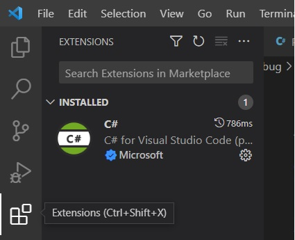
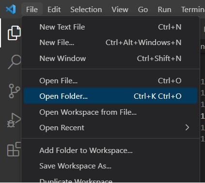
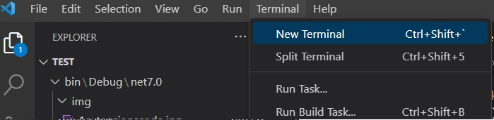
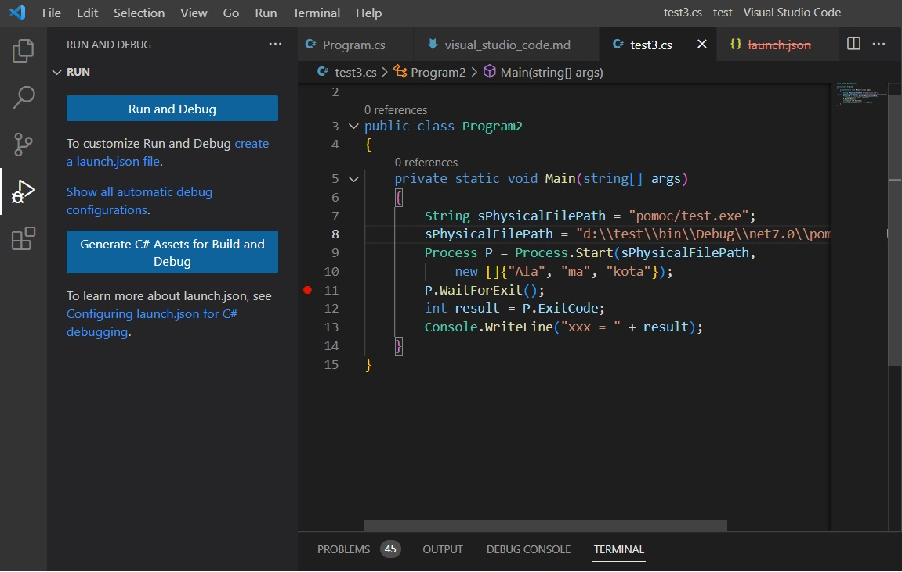
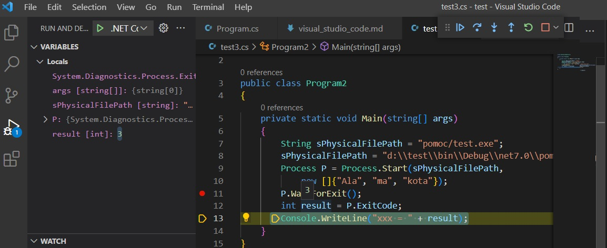
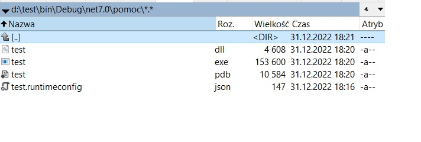
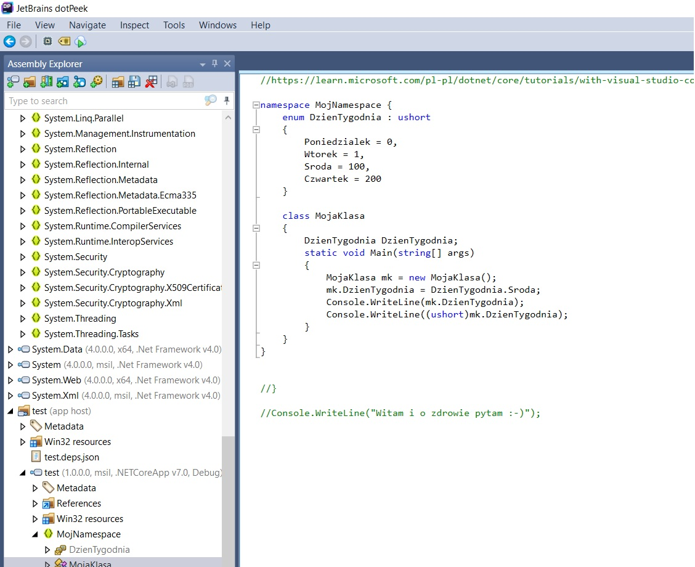

# Pierwsze aplikacje konsolowe C# .NET Framework Core 7.0

## Autor: Tomasz Hachaj

Treść:
- [Pierwsze aplikacje konsolowe C# .NET Framework Core 7.0](#pierwsze-aplikacje-konsolowe-c-net-framework-core-70)
  - [Autor: Tomasz Hachaj](#autor-tomasz-hachaj)
  - [Platforma .NET Framework, język C#, biblioteki .NET Core, Visual Studio i Visual Studio Code](#platforma-net-framework-język-c-biblioteki-net-core-visual-studio-i-visual-studio-code)
  - [Instalacja wymaganego oprogramowania](#instalacja-wymaganego-oprogramowania)
  - [Tworzenie i uruchamianie nowego projektu konsolowego (console application)](#tworzenie-i-uruchamianie-nowego-projektu-konsolowego-console-application)
  - [Debugowanie aplikacji konsolowej .NET przy użyciu Visual Studio Code](#debugowanie-aplikacji-konsolowej-net-przy-użyciu-visual-studio-code)
  - [Operacje wejścia - wyjścia przy pomocy konsoli](#operacje-wejścia---wyjścia-przy-pomocy-konsoli)
  - [Odczyt i zapis do pliku](#odczyt-i-zapis-do-pliku)
  - [Top-level statements](#top-level-statements)
  - [Wsteczna inżynieria - dekompilacja i przeglądanie zasobów .Net przy pomocy JetBrains](#wsteczna-inżynieria---dekompilacja-i-przeglądanie-zasobów-net-przy-pomocy-jetbrains)
  - [Literatura](#literatura)

## Platforma .NET Framework, język C#, biblioteki .NET Core, Visual Studio i Visual Studio Code

.NET CORE jest darmową, wieloplatformową, otwartym rozwiązaniem programistycznym do budowania wielu różnych typów aplikacji. W wersji 7.0 wspierany jest Windows, Linux (różne dystrybucje) oraz MacOS. 

Microsoft .Net Framework to platforma programistyczna do budowania i uruchamiania aplikacji Windows .Net framework, który obejmuje narzędzia deweloperskie, języki programowania i biblioteki, które są używane do tworzenia aplikacji desktopowych i internetowych. 

Kluczowa różnica między .NET Core i .NET Framework to platforma dla aplikacji .NET w systemie Windows, podczas gdy NET Core to najnowsza wersja .NET Framework, która jest międzyplatformowym i otwartym frameworkiem.

https://www.interviewbit.com/blog/net-core-vs-net-framework/

## Instalacja wymaganego oprogramowania

- Visual Studio Code [link](https://code.visualstudio.com/)
- Dodatek (extension) #C For Visual Studio Code - OmniSharp [link](https://marketplace.visualstudio.com/items?itemName=ms-dotnettools.csharp)



- Platforma .Net 7.0 [link](https://dotnet.microsoft.com/en-us/download/dotnet/7.0)
- Automatyczna sugestia importów przestrzeni nazw nie jest konieczna, ale jej brak jest kłopotliwy [link](https://marketplace.visualstudio.com/items?itemName=steoates.autoimport)
- Przydatna aplikacja - dekompilator i przeglądarka binariów .NET DotPeak [link](https://www.jetbrains.com/decompiler/)
- Przydatny dodatek kiedy pisze się pliki MD, żeby nie wyjść na analfabetę ;-) [spell checker](https://marketplace.visualstudio.com/items?itemName=streetsidesoftware.code-spell-checker), [spell checker polish](https://marketplace.visualstudio.com/items?itemName=streetsidesoftware.code-spell-checker-polish)

## Tworzenie i uruchamianie nowego projektu konsolowego (console application)

- Projekt znajduje się w katalogu i składa się z zestawu plików. Otwarcie folderu może odbyć się z poziomu głównego menu



Nazwa folderu staje się nazwą projektu i nazwą przestrzeni nazw domyślnie. Przy otwieraniu folderu należy wybrać opcję: "Tak, ufam autorom" (Yes, I trust the authors (Trust folder and enable all features)).

- Następnie należy stworzyć szablon projektu .Net 7.0. Aby to zrobić otwórz terminal w Visual Studio Code



W terminalu wprowadzamy polecenie:

```cs

dotnet new console --framework net7.0

```

- Pliki z kodem w języku C# mają rozszerzenie *.cs. Począwszy od C# 9, nie musisz jawnie dołączać metody Main w projekcie aplikacji konsolowej. Nie trzeba również deklarować klasy, w której będzie znajdować się kod C#. W tym przypadku kompilator generuje klasę i punkt wejścia metody Main dla aplikacji. Ten typ konstrukcji nazywa się [Top-level statements](#top-level-statements) 


```cs

Console.WriteLine("Witam i o zdrowie pytam :-)");

```

Czasem zdarza się sytuacja, że Visual Studio Code sygnalizuje błąd "The namespace 'NAZWA' already contains a definition for 'NAZWA'", choć składnia jest poprawna. Należy wtedy zrestartować OmniSharp:

```cs

CTRL + SHIFT + P

Restart OmniSharp

```

- Aby skompilować do kodu pośredniego oraz uruchomić aplikację w terminalu należy wpisać polecenie

```cs

dotnet run

```

Polecenie dotnet run uruchamia aplikację z poziomu kodu źródłowego. Wykorzystuje ono polecenie dotnet build, aby skompilować kod.

```cs

dotnet build

```

Jeżeli użyjemy dotnet run nie musimy używać niezależnie dotnet build. Więcej na temat polecenie dotnet build można przeczytać tu: [link](https://learn.microsoft.com/pl-pl/dotnet/core/tools/dotnet-run).

- Jeżeli nie chcemy używać [Top-level statements](#Top-level-statements) możemy użyć pełnej deklaracji ze statyczną metodą Main wewnątrz klasy.

```cs

class MojaKlasa
{
    static void Main(string[] args)
    {
        Console.WriteLine("Witam i o zdrowie pytam :-)");
    }
}
```

- Użycie kilki przestrzeni nazw:


```cs

namespace MojNamespace2
{
    class DrugaKlasa {
    }
}

namespace MojNamespace {
    class MojaKlasa
    {
        static void Main(string[] args)
        {
            Type myType = typeof(MojNamespace2.DrugaKlasa);
            Console.WriteLine("GlobalClass type: " 
            + myType + "\nGlobalClass namespace" 
            + myType.Namespace);
        }
    }
}
```

- Alternatywnie, jeżeli nie chcemy podawać nazwy klasy poprzedzonej przez nazwę przestrzeni nazw można użyć using.


```cs
using MojNamespace2;
namespace MojNamespace2
{
    class DrugaKlasa {
    }
}

namespace MojNamespace {
    class MojaKlasa
    {
        static void Main(string[] args)
        {
            Type myType = typeof(DrugaKlasa);
            Console.WriteLine("GlobalClass type: " 
            + myType + "\nGlobalClass namespace" 
            + myType.Namespace);
        }
    }
}
```

Jak widać w jednym pliku *.cs może zostać zadeklarowanych wiele klas oraz wiele przestrzeni nazw. Nie ma restrykcji odnośnie nazw plików - nie muszą nazywać się tak, jak nazwy klas czy przestrzeni nazw, które się w nim znajdują. Deklaracja kilku klas w jednym pliku nie wymaga ich zagnieżdżania jednej w drugiej. Jeżeli klasa jest zadeklarowana wewnątrz innej klasy odwołujemy się do niej w następujący sposób:

```cs

namespace MojNamespace2
{
    class DrugaKlasa {
        public class TrzeciaKlasa {

        }
    }
} 

namespace MojNamespace {
    class MojaKlasa
    {
        class DrugaKlasa {
        }
        static void Main(string[] args)
        {
            Type myType = typeof(DrugaKlasa);
            Console.WriteLine("GlobalClass type: " 
            + myType + "\nGlobalClass namespace " 
            + myType.Namespace);

            myType = typeof(MojNamespace2.DrugaKlasa.TrzeciaKlasa);
            Console.WriteLine("GlobalClass type: " 
            + myType + "\nGlobalClass namespace " 
            + myType.Namespace);
        }
    }
}
```

- Powyższa zagnieżdżona konstrukcja w praktyce występuje bardzo rzadko. Najczęściej spotyka się ją podczas definicji typu wyliczeniowego, z którego korzysta dana klasa.

```cs

namespace MojNamespace {
    enum DzienTygodnia : ushort
    {
        Poniedzialek = 0,
        Wtorek = 1,
        Sroda = 100,
        Czwartek = 200
    }

    class MojaKlasa
    {
        DzienTygodnia DzienTygodnia;
        static void Main(string[] args)
        {
            MojaKlasa mk = new MojaKlasa();
            mk.DzienTygodnia = DzienTygodnia.Sroda;
            Console.WriteLine(mk.DzienTygodnia);
            Console.WriteLine((ushort)mk.DzienTygodnia);
        }
    }
}

```

## Debugowanie aplikacji konsolowej .NET przy użyciu Visual Studio Code

Debugowanie aplikacji może odbywać się przy pomocy breakpointów, które ustawiamy w odpowiednich linijkach kodu. 



Breakpointy widoczne są jako czerwone kropki. Aby uruchomić możliwość debugowania należy stworzyć lunch.json file - można tego dokonać automatycznie naciskając odpowiedni link button. 

Po wykonaniu powyższej konfiguracji można już korzystać z debugera i uruchamiać oraz śledzić wykonanie kodu aplikacji przy pomocy dedykowanego zestawu kolorowych przycisków. Podglądnięcie wartości zmiennej odbywa się poprzez najechanie na nią myszką.



Więcej o możliwych konfuguracjach debugera można poczytać tu: [link](https://learn.microsoft.com/pl-pl/dotnet/core/tutorials/debugging-with-visual-studio-code?pivots=dotnet-7-0).


## Operacje wejścia - wyjścia przy pomocy konsoli

Wypisywanie do konsoli odbywa się przy pomocy funkcji statycznych Console.Write albo Console.WriteLine.

```cs

//wypisywanie do konsoli - różne sposoby konkatenacji napisów
int liczba = 45;
string napis = "jakiś napis";
Console.WriteLine("Liczba to " + liczba + " a napis to " + napis + ".");
Console.WriteLine("Liczba to {0} a napis to {1}.", liczba, napis);
Console.WriteLine($"Liczba to {liczba} a napis to {napis}.");


```

Wzcytywanie danych z klawiatury odbywa się przy pomocy statycznych metod Console.ReadLine oraz Console.Read.

```cs

Console.WriteLine("Wpisz tekst i naciśnij enter:");
String napis = Console.ReadLine();
Console.WriteLine($"Wczytano napis {napis}");
//odczytuje następny znak ze standardowego strumienia wejściowego,
//zwraca wartość ascii tego znaku
//spróbuj wpisać np. asd
int kod = Console.Read();
Console.WriteLine("Read wczytał literę " + (char)kod);
kod = Console.Read();
Console.WriteLine("Read wczytał literę " + (char)kod);
Console.WriteLine("Wciśnij dowolny klawisz aby zakończyć program.");
//ReadKey oczekuje na wciśnięcie klawisza
Console.ReadKey();

```

## Odczyt i zapis do pliku

Odczyt i zapis do pliku odbywa się przy pomocy strumieni. Poniższy program przestawia przykładowy zapis do pliku danych w z konsoli.

```cs

//zapisywanie do pliku linijka po linijce
string nazwaPliku = "plik.txt";
StreamWriter sw;
//jeśli plik istnieje, tekst dodajemy na końcu
if (File.Exists(nazwaPliku))
    sw = new StreamWriter(nazwaPliku, append: true);
else
    sw = new StreamWriter(nazwaPliku);
String napis = "";
//wczytujemy napisy z klawiatury tak długo, aż trafimy
//na napis "koniec!"
Console.WriteLine("Wprowadź tekst do pliku, aby zakończyć wprowadzenie napisz 'koniec!'");
napis = Console.ReadLine();
while (napis != "koniec!")
{
    sw.WriteLine(napis);
    napis = Console.ReadLine();
}
//zamykamy strumień
sw.Close();
//inforacje o pliku
FileInfo FileProps =new FileInfo(nazwaPliku);
Console.WriteLine("Nazwa pliku: {0}\n utworzono: {1}\n"
    + "ostatni dostęp {2}\n ostatni zapis {3}\n rozmiar: {4}\n",
    FileProps.FullName, FileProps.CreationTime,
    FileProps.LastAccessTime, FileProps.LastWriteTime, 
    FileProps.Length);


```

Poniższy program znajduje w zadanym katalogu plik o największej długości o odczytuje z niego dane interpretując dane binarnie oraz jako napisy.

```cs

//katalog, w którym szukamy plików
string dirPath = ".";
string[] pliki = Directory.GetFiles(dirPath);
//obiekt wskazujący na najdłuższy plik
FileInfo najdluzszyPlik = null;
//szukamy najdłuższego pliku
foreach (string plik in pliki )
{
    FileInfo informacje = new FileInfo(plik);
    if (najdluzszyPlik == null)
        najdluzszyPlik = informacje;
    else
        if (informacje.Length > najdluzszyPlik.Length)
            najdluzszyPlik = informacje;
}
//jeżeli znaleziono najdłuższy plik
if (najdluzszyPlik != null)
{
    Console.WriteLine("Najdłuższy plik to {0}", najdluzszyPlik.Name);
    //czytamy i wypisujemy 5 pierwszych bajtów z pliku
    FileStream fsr = najdluzszyPlik.OpenRead();
    byte[]bajty = new byte[5];
    //czyta pięć pierwszych bajtów
    int ileWczytano = fsr.Read(bajty, 0, 5);
    //wypisujemy bajty jako char (nie bierzemy pod uwagę
    //czy plik jest binarny i jakie ma kodowanie)
    for (int a = 0; a < ileWczytano; a++)
    {
        Console.Write((char)bajty[a]);
    }
    //czytamy cały plik linijka po linijce jako tekst
    //i wypisujemy do konsoli
    StreamReader sr = new StreamReader(fsr);
    string napis = sr.ReadLine();
    while (napis != null){
        Console.WriteLine(napis);
        napis = sr.ReadLine();
    }
}

```

## Top-level statements

Deklaracje najwyższego poziomu (Top-level statements) pozwalają pisać proste programy bez konieczności jawnej deklaracji klasy oraz metody Main.

```cs

Console.WriteLine("Witam i o zdrowie pytam :-)");

```

Kod pośredni (IL) dla powyższego kodu wyświetlony przy pomocy DotPeak wygląda w następujący sposób:


```cs

// Type: Program 
// Assembly: test, Version=1.0.0.0, Culture=neutral, PublicKeyToken=null
// MVID: 3AE0CD7A-34E7-4B07-B69F-3FF3CEDF8F94
// Location: D:\test\bin\Debug\net7.0\test.dll
// Sequence point data from D:\test\bin\Debug\net7.0\test.pdb

.class private auto ansi beforefieldinit
  Program
    extends [System.Runtime]System.Object
{
  .custom instance void [System.Runtime]System.Runtime.CompilerServices.CompilerGeneratedAttribute::.ctor()
    = (01 00 00 00 )

  .method private hidebysig static void
    '<Main>$'(
      string[] args
    ) cil managed
  {
    .entrypoint
    .maxstack 8

    // [13 1 - 13 50]
    IL_0000: ldstr        "Witam i o zdrowie pytam :-)"
    IL_0005: call         void [System.Console]System.Console::WriteLine(string)
    IL_000a: nop
    IL_000b: ret

  } // end of method Program::'<Main>$'

  .method public hidebysig specialname rtspecialname instance void
    .ctor() cil managed
  {
    .maxstack 8

    IL_0000: ldarg.0      // this
    IL_0001: call         instance void [System.Runtime]System.Object::.ctor()
    IL_0006: nop
    IL_0007: ret

  } // end of method Program::.ctor
} // end of class Program

```

Widać więc, że został utworzony entrypoint Main z listą parametrów wejściowych string[] args. Metoda znajduje się w klasie Program dziedziczącej z klasy System.Object.

Aplikacja powinna mieć tylko jeden entrypoint. Jeżeli jest ich więcej, należy jawnie wskazać, który ma być używany. Projekt może mieć tylko jeden plik z deklaracjami najwyższego poziomu (Top-level statements) i jest on nadrzędny wobec innych entrypointów (pozostałe są ignorowane). Umieszczenie oświadczeń najwyższego poziomu w więcej niż jednym pliku w projekcie powoduje następujący błąd kompilatora:

```cs

CS8802 Only one compilation unit can have top-level statements.
```

```cs
CS8802: Tylko jedna jednostka kompilacji może mieć instrukcje najwyższego poziomu.
```

Projekt może mieć dowolną liczbę dodatkowych plików kodu źródłowego, które nie mają deklaracji najwyższego poziomu.

Jeżeli kod źródłowy używa dyrektywy/dyrektyw using, muszą one znajdować się na początku kodu źródłowego.


```cs
using System.Globalization;

DateTime localDate = DateTime.Now;
DateTime utcDate = DateTime.UtcNow;
String[] cultureNames = { "pl-PL", "en-US", "en-GB", "fr-FR",
                        "de-DE", "ru-RU" } ;

foreach (var cultureName in cultureNames) {
    var culture = new CultureInfo(cultureName);
    Console.WriteLine("{0}:", culture.NativeName);
    Console.WriteLine("   Local date and time: {0}, {1:G}",
                    localDate.ToString(culture), localDate.Kind);
    Console.WriteLine("   UTC date and time: {0}, {1:G}\n",
                    utcDate.ToString(culture), utcDate.Kind);
}
```

Wybór "kultury" ma wpływ na formatowanie liczb i dat.

```cs

using System.Globalization;
double a = 4.5;
Console.WriteLine(a);
var culture = new CultureInfo("en-US");
Console.WriteLine(a.ToString(culture));
CultureInfo.CurrentCulture = culture;
Console.WriteLine(a);

```

Plik z deklaracjami najwyższego poziomu może również zawierać przestrzenie nazw i definicje typów, ale muszą one pojawić się po deklaracjach najwyższego poziomu.

```cs
foreach (var si in SystemInfo.GetInfo())
{
    Console.WriteLine(si);
}

public class SystemInfo {
    public static String[]GetInfo()
    {
        String []info = {
            System.Environment.UserDomainName,
            System.Environment.OSVersion.ToString()};
        return info;
    }
}
```

Polecenia najwyższego poziomu mogą odwoływać się do zmiennej args, aby uzyskać dostęp do argumentów wiersza poleceń, które zostały podane. Zmienna args nigdy nie jest pusta, ale jej długość wynosi zero, jeśli nie podano żadnych argumentów wiersza poleceń.

```cs

int a = 0;
for (a = 0; a < args.Length; a++)
{
    Console.WriteLine(args[a]);
    
}
if (a == 0)
{
    Console.WriteLine("Nie podano argumentów");
}

```

Top-level statement może też zwrócić wartość typu int przy pomocy return. Działa to identycznie jak return w metodzie Main. 

```cs

return args.Length;

```

Aby uruchomić program, który pobierze zwrócone przez powyższy program rezultaty wyjściowe można to zrobić w następujący sposób:

- Program, który chcemy uruchomić i pobrać z niego parametry wyjściowe umieszczamy np. w podkatalogu:



UWAGA! Plik appname.runtimeconfig.json (dla konfiguracji debug i release) jest potrzebny na tej samej ścieżce co appname.dll.

- Program pobierający parametry wyjściowe programu zwracającego liczbę parametrów wejściowych:


```cs

using System.Diagnostics;

public class Program2
{
    private static void Main(string[] args)
    {
        String sPhysicalFilePath = "pomoc/test.exe";
        Process P = Process.Start(sPhysicalFilePath, 
            new []{"Ala", "ma", "kota"});
        P.WaitForExit();
        int result = P.ExitCode;
        Console.WriteLine(result);
    }
}

```

## Wsteczna inżynieria - dekompilacja i przeglądanie zasobów .Net przy pomocy JetBrains

- DotPeek jest darmowym dekompilatorem i przeglądarką zasobów .NET. Współpracuje z:

    * Dynamicznie linkowanymi bibliotekami (*.dll)

    * Plikami wykonywalnymi (*.exe)

    * Plikami Windows 8 metadata (*.winmd)

    * Archiwami (*.zip)

    * Pakietami NuGet (*.nupkg)

    * Pakietami Microsoft Visual Studio Extensions (*.vsix)

Pozwala również na przeglądanie projektów w postaci kodu pośredniego. Dzięki DotPeek można łatwo sprawdzić na jakiej zasadzie działają skompilowane aplikacje platformy .NET, z jakich składają się klas, jak również wykorzystać poszczególne ich części części składowe we własnych projektach (jeśli jest to zgodne z warunkami licencji :-) ).



 DotPeek jest więc narzędziem wstecznej inżynierii. Aby UTRUDNIĆ (ale nie uniemożliwić) wsteczną inżynierię projektów .NET można stosować narzędzia "zaciemniające kod" [code obfuscation](https://www.google.com/search?q=.net+code+obfuscation).

Więcej na ten temat można obejrzeć np. w materiale [youtube](https://www.youtube.com/watch?v=tRHOBV31BeU).


## Literatura 

[Tworzenie nowego projektu (learn.microsoft)](https://learn.microsoft.com/pl-pl/dotnet/core/tutorials/with-visual-studio-code?pivots=dotnet-7-0)

[Debugowanie aplikacji konsolowej .NET przy użyciu Visual Studio Code (learn.microsoft)](https://learn.microsoft.com/pl-pl/dotnet/core/tutorials/debugging-with-visual-studio-code?pivots=dotnet-7-0)

[Top-level statements (learn.microsoft)](https://learn.microsoft.com/en-us/dotnet/csharp/fundamentals/program-structure/top-level-statements)

[Dokumentacja dekompilatora JetBrains (jetbrains)](https://www.jetbrains.com/help/decompiler/2022.3/dotPeek_Introduction.html)

[Ciekawy materiał o code obfuscation (youtube)](https://www.youtube.com/watch?v=tRHOBV31BeU)
